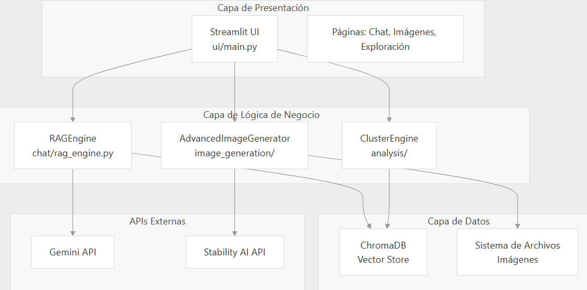
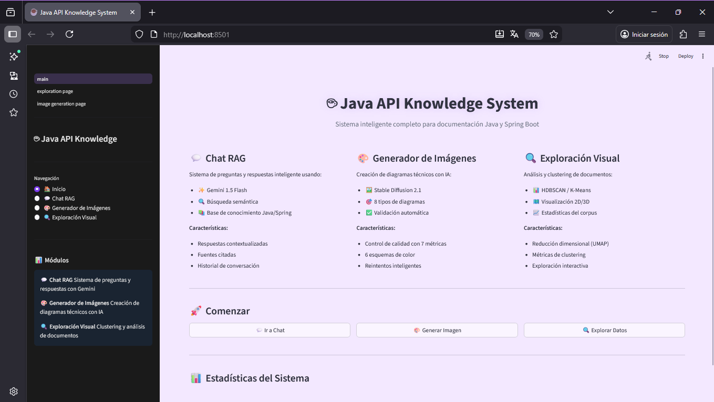
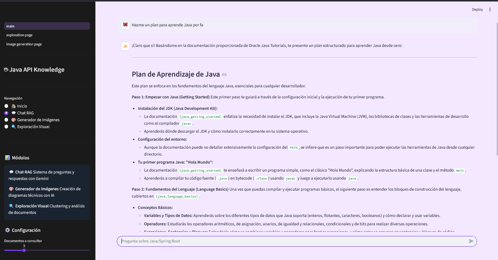
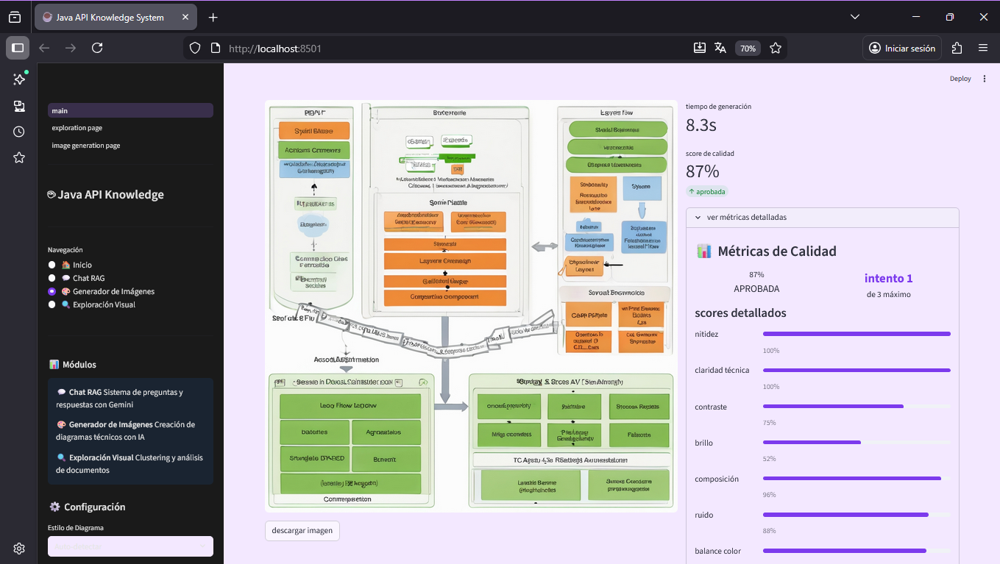

# Arquitectura

# UI

# Respuestas API

## Chat

## Imagenes

## Configuración y Ejecución

1. Instalación de Dependencias

pip install -r requirements.txt

2. Configurar API Keys

Crear archivo .env con: launch_demo.py:34-38

GEMINI_API_KEY=tu_api_key_de_gemini  
STABILITY_API_KEY=tu_api_key_de_stability_ai

3. Ejecutar Aplicación

python launch_demo.py
La aplicación abrirá en http://localhost:8501

